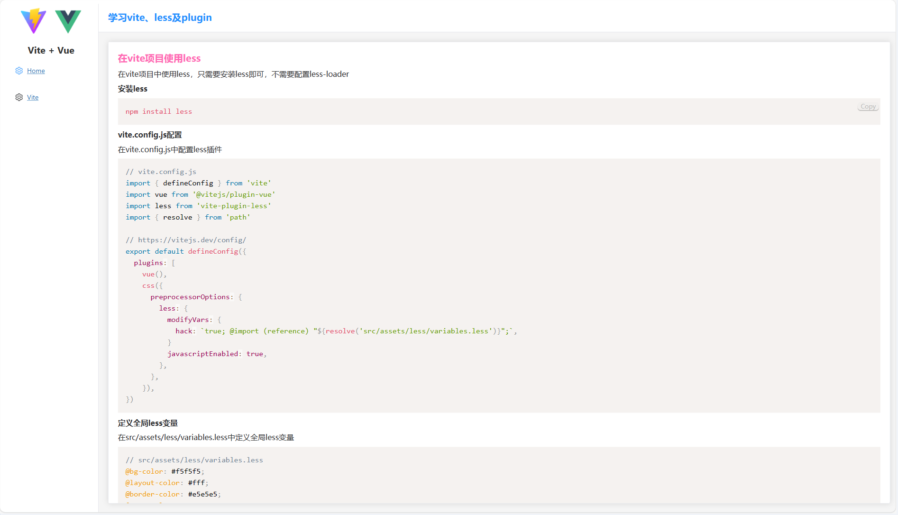
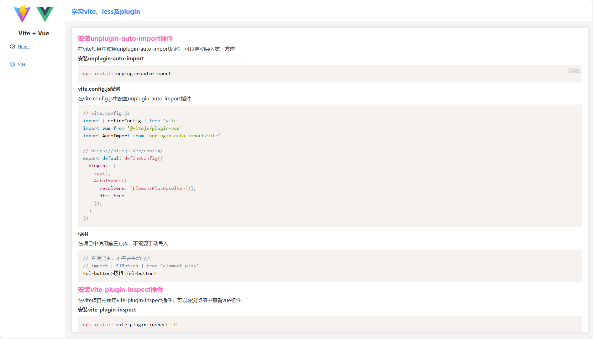
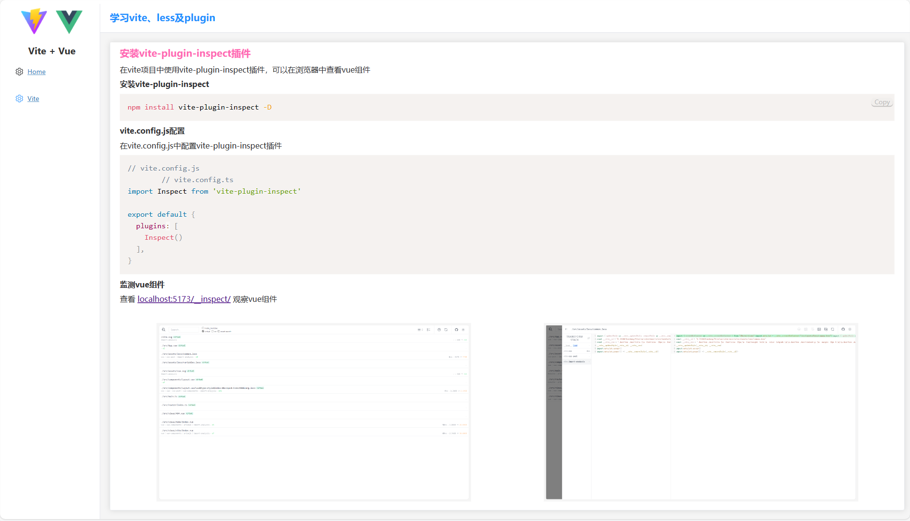

## 项目介绍

本项目是一个简单的vue-vite项目，用于学习vite的使用。
项目中使用了许多插件
- AutoImport(unplugin-auto-import/vite)
- prismjsPlugin(vite-plugin-prismjs)
- Inspect(vite-plugin-inspect)

## 项目启动
```shell
git clone https://github.com/MJ-young/vue-vite-less-ts.git
npm install
npm run dev
```

## 项目打包
```shell
npm run build
```

## 界面展示
- 主页
  - 
- plugins
  - 
  - 
